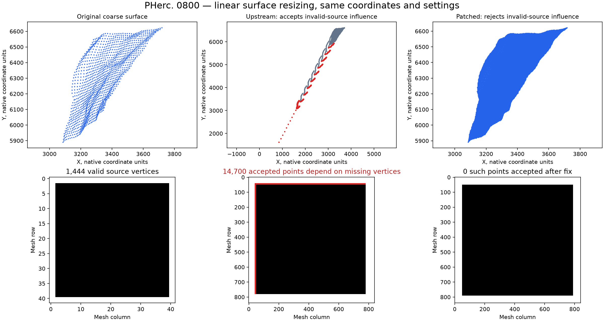

# TIFXYZ resize validity: patch and real-scroll evidence

A focused correction to the public `vesuvius.tifxyz.upsample_coordinates` API. During resizing, the existing nearest-resized validity mask can accept coordinates contaminated by missing source vertices. The patch checks support at the actual linear/cubic interpolation positions, while preserving coordinate interpolation.

## Results

Three byte-original PHerc0800 surface patches were resized at their metadata scale. Accepted output points with invalid source support changed as follows:

| Interpolation | Before | After |
|---|---:|---:|
| Linear | 74,100 | 0 |
| Cubic | 71,700 | 0 |

Coordinates accepted by both versions are bit-for-bit identical. Nearest-neighbor output is unchanged. The same number of wrongly rejected valid locations is recovered in these fixtures.

53 focused regression tests pass on OpenCV 5.0.0 and 4.14.0; 21 nearby I/O/preflight tests also pass. This is a direct API geometry evaluation on three patches of one scroll. Community adoption, downstream CT/ink improvement, maintainer acceptance, and a prize award are not established.

## Review and reproduce

- [Technical report](REVIEW_REPORT.md) — methods, results, timing and limitations
- [Thread-configuration clarification](PROVENANCE_CLARIFICATION.md) — recorded environment discrepancy; original evidence preserved
- [Patch](evidence/tifxyz-resampling-validity.patch) — two changed files against pinned upstream `d8c5f488a105286c548c99c5f7c7ad9f29e3ed14`
- [Reproduction instructions](REPRODUCE.md) — reconstruct the source and run the checks
- [Quantitative evidence](evidence/real_mesh_results.json) and [run log](evidence/real_mesh_run.log)
- [Original data and attribution](data/README.md), [download URLs and checksums](data/PUBLIC_DATA_MANIFEST.json)
- [Independent numerical review](tools/NUMERIC_RESIZE_REVIEW.md), including historical issues found and fixed before the final run
- [Bounded duplicate screen](DUPLICATE_SCREEN.md)

The `review_source/` directory contains the two changed files for inspection. It is not a complete package; use the pinned-source reconstruction instructions. Code, patch and tests are included, not only a report.

## Entrant’s stated view

The following view was explicitly endorsed by Zackary Loevseth; the wording was prepared with AI assistance:

> I see this as a useful, reproducible geometry correction. The fix was demonstrated on three genuine scroll meshes. For workflows using this function, it prevents this source of bad geometry from passing into later rendering or analysis.
>
> I also recognize the limits: we haven’t demonstrated improved ink recognition or confirmed regular community use of this particular function. Its practical importance and any prize value still depend on maintainer review and adoption.

## Contribution transparency

Codex performed implementation, real-data execution, documentation, and independent AI-assisted review at the entrant’s request. The entrant supplied approval of the stated assessment and publication/submission. Personal human code review has not been represented as completed. This evidence repository is not an upstream pull request and does not assert compliance with its separate personal-verification checkbox.

## Licenses and provenance

Software code follows the upstream [MIT license](LICENSE). Original scroll data and derived geometry/figures retain **CC BY-NC 4.0** attribution; see [data documentation](data/README.md). The MIT license does not replace third-party data or document licenses. [Publication notes](PUBLICATION_NOTES.md) explain sanitization of local paths and acquisition-time metadata. The source code, original datasets and measured results were not modified during publication preparation.
